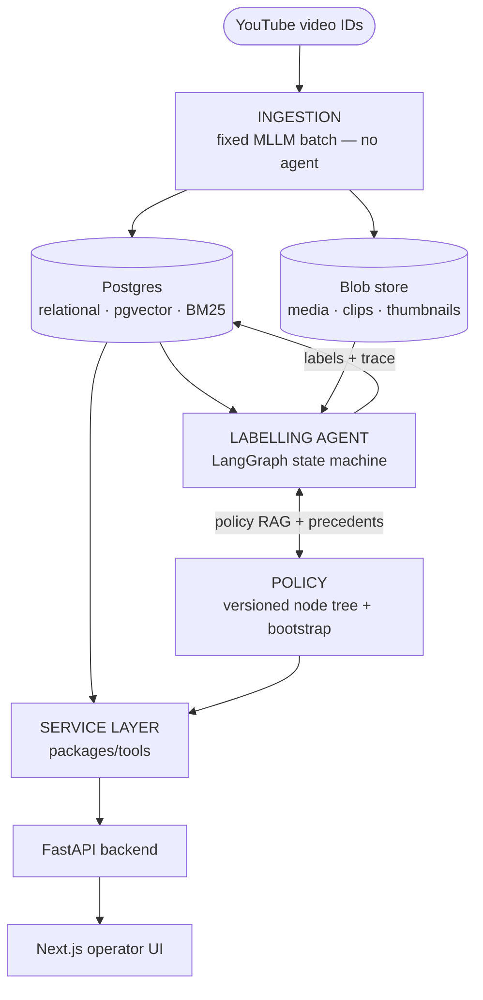

# Video Labelling — Gameplay Content Moderation (PoC)

게임 관련 영상을 **shot(segment) 단위**로 자동 분류하는 **Agentic Auto-Labelling 시스템**.
최우선 목표는 **일관적(consistent)** 이고 **근거 추적(traceable)** 가능한 데이터 구축이다.
(실서비스용 경량 모더레이션 모델 서빙은 범위 밖.)

PoC 범위: PEGI 하위 **Gambling / Bad Language / Sex** 3개 카테고리, 연령 스코어 **0–5**.

## System Architecture



<sub>Detail lives in the docs: ingestion → [DATA_FLOW](docs/DATA_FLOW.md), the agent stages/tools → [AGENT_WORKFLOW](docs/AGENT_WORKFLOW.md), the whole system → [ARCHITECTURE](docs/ARCHITECTURE.md).</sub>

## Documentation

- [ARCHITECTURE](docs/ARCHITECTURE.md) ([한국어](docs/ARCHITECTURE.ko.md)) — system overview, data model (ER), diagrams
- [DATA_FLOW](docs/DATA_FLOW.md) ([한국어](docs/DATA_FLOW.ko.md)) — how a video becomes labels
- [AGENT_WORKFLOW](docs/AGENT_WORKFLOW.md) ([한국어](docs/AGENT_WORKFLOW.ko.md)) — the LangGraph state machine

## Layout

| Path | Role |
|---|---|
| `packages/schemas` | 공유 Pydantic 계약 (Video/Segment/Attribute/Label/Policy…) |
| `packages/tools` | stateless service layer (storage·blob·embeddings·retrieval·policy_store) |
| `packages/models` | 모델 provider 추상화 + config/profile 로더 |
| `ingestion` | 고정 MLLM batch 파이프라인 |
| `labelling` | LangGraph orchestrator agent + agent tools |
| `policy` | bootstrap (PEGI seed → policy-set v1) |
| `app/backend` | FastAPI (service layer 래핑) |
| `app/ui` | Next.js (Data Viewer · Policy · DB browser) |
| `db` | SQLAlchemy models + Alembic |
| `config` | `config.yaml` + `profiles/*.yaml` (proprietary ↔ local vLLM) |

## Setup

```bash
# 1. Infra (Postgres + pgvector)
docker compose up -d postgres

# 2. Python env
python -m venv .venv && source .venv/bin/activate
pip install -e ".[dev]"

# 3. Config
cp .env.example .env          # fill provider API keys; pick MODEL_PROFILE

# 4. DB schema (first migration must CREATE EXTENSION vector + tsvector indexes)
alembic -c db/alembic.ini upgrade head

# 5. Backend / UI
uvicorn backend.main:app --reload           # http://localhost:8000
cd app/ui && npm install && npm run dev      # http://localhost:3000
```

### Video 데이터
PoC는 **YouTube에서 취득 가능한 영상**으로 한정한다. 저장소에는 **Video ID만 기록**하며,
실제 영상은 [`yt-dlp`](https://github.com/yt-dlp/yt-dlp) 등으로 받을 수 있다.

## Model providers
역할별(mllm / asr / text_embedding / image_embedding / agent_llm) provider를 `config/profiles/<name>.yaml`
에서 지정한다. 기본 profile은 proprietary API(OpenAI/Gemini/Claude)이며, 실험 시 local vLLM
엔드포인트를 가리키는 profile로 교체한다. 코드 변경 없이 config로 전환.

### Local model profile
로컬 vLLM 가중치로 ingestion을 돌리려면:

```bash
cp config/profiles/local.example.yaml config/profiles/local.yaml
# local.yaml 을 열어 각 model_path 를 실제 가중치 디렉토리로 채운다
export MODEL_PROFILE=local
```

`local.yaml` 은 **git 에 추적되지 않는다** — 각자 환경의 모델 경로를 직접 입력한다.
`local.example.yaml` 의 주석이 각 역할(ASR / Omni MLLM / text embedding / visual embedding)을 설명한다.

### FlashAttention (vLLM 서빙)
vLLM 서빙에는 FlashAttention 이 필요하다. wheel 은 torch/CUDA/Python 조합마다 다르므로
`pyproject.toml` 에 넣지 않는다 — **각자 환경에 맞는 pre-built wheel 을 직접 설치**한다.

```bash
# 1. 내 환경 버전 확인
python -c "import torch,sys; print(torch.__version__, torch.version.cuda, f'cp{sys.version_info.major}{sys.version_info.minor}')"

# 2. 아래 릴리스에서 torch/cuda/cp 조합에 맞는 wheel URL 을 찾아 설치
#    https://github.com/mjun0812/flash-attention-prebuild-wheels/releases
pip install <matching-wheel-url>
```

그다음 `bash scripts/serve_vllm.sh` 로 Agent 단계 모델 서버(Omni/text-embed/visual-embed)를
띄운다 (GPU/포트 배치는 스크립트 참고).

### ASR + 정렬 서버 (별도 venv)
ingestion의 ASR(Qwen3-ASR)+ForcedAligner는 `vllm==0.14` 를 핀하므로, 메인 venv(vllm 0.26)와
**반드시 분리**한다. 같은 venv에 깔면 vllm/torch가 다운그레이드되어 다른 서버가 깨진다.

```bash
uv venv /tmp/iji-qwen-asr-venv --python 3.12
uv pip install --python /tmp/iji-qwen-asr-venv/bin/python "qwen-asr[vllm]" fastapi "uvicorn[standard]"
bash scripts/serve_asr.sh          # word-level timestamps, :8810 (GPU1)
```

ingestion은 이 서버(:8810)를 HTTP로 호출해 word-level ASR(utterances)만 만든다. clip/summary/
embedding은 이후 labelling agent 단계에서 생성한다.
