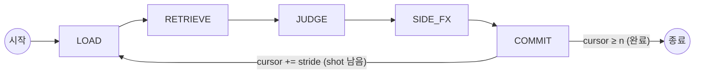
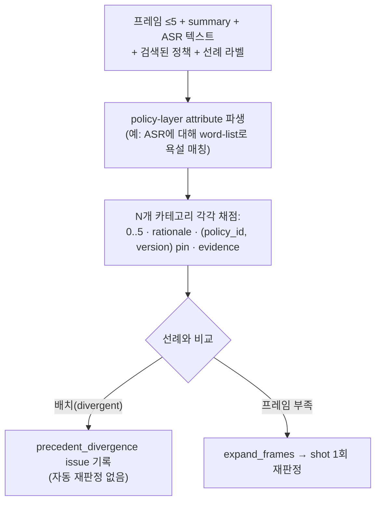

# 에이전트 워크플로 (Agent Workflow)

*언어: [English](AGENT_WORKFLOW.md) · **한국어***

labelling 에이전트는 **LangGraph 상태 머신**이다 — 고정된 단계(stage)들이 각각
제한된 도구 집합을 가지며, 자유로운 ReAct가 **아니다**. shot window가 영상 위를
슬라이딩하며 모든 shot이 라벨링될 때까지 진행한다. 전역 영상 컨텍스트와 롤링
carry-over 요약이 항상 주입된다.

이전 초안의 `DERIVE`와 `CHECK`는 **JUDGE로 흡수**되었다 (policy attribute 파생과
선례 일관성 체크가 판정 단계 안에서 수행됨). `SIDE_FX`는 유지된다.

## Orchestrator 모델

Orchestrator는 config의 `agent_llm` 역할로 선택되는 **멀티모달 LLM**이다(config
기반, 교체 가능). 현재는 **Gemini 3.5 Flash**(API). 향후 shot의 raw 오디오를
입력으로 추가할 수 있도록 **오디오 가능 모델**을 의도적으로 선택했다.

인지(perception)는 **가볍게** 유지한다: 모델은 clip 전체를 보지 않는다. shot마다
**uniform 샘플링된 프레임 ≤ 5장** + coarse `summary` + 해당 shot의 ASR 텍스트를
받는다. 프레임이 부족하면 에이전트는 **`expand_frames`**를 호출해 추가/조밀한
프레임을 요청할 수 있다.

> **알려진 공백 (GitHub issue로 추적):** raw **오디오는 아직 orchestrator에
> 입력되지 않는다** — 음성은 ASR 텍스트로만 대체된다. raw shot 오디오를 JUDGE에
> 배선하는 작업은 per-run trace 플래그가 아니라 **저장소 issue**로 추적한다.

## Window

`config/config.yaml → labelling`에서:

- `window_size = 5` — 스텝당 보이는 shot 수 (confirm shot + 이웃 컨텍스트)
- `window_stride = 3` — 스텝당 확정(commit)되는 shot 수 (overlap = size − stride = 2)
- `carry_over = rolling_summary` — 확정 판정들의 러닝 요약. 항상 존재하는
  `global_overview`와 함께 매 스텝 주입됨

## 카테고리는 파라미터화

카테고리 집합은 **하드코딩하지 않는다.** 활성 정책 세트(`config
policy.categories`, 현재 gambling / bad_language / sex)에서 N-길이 리스트로
주입된다. 프롬프트와 코드가 이 리스트를 순회하므로, 카테고리 추가/제거는
코드 변경이 아니라 config/정책 변경이다. N개 카테고리는 shot당 **한 번의
패스**로 판정한다.

## 단계 (Stages)

### LOAD
`all_segments[cursor : cursor + window_size]`에서 `window`를 구성한다. 앞쪽
`window_stride`개 shot이 **confirm** shot(이번 스텝에 commit)이고, 나머지는 이웃
컨텍스트다. 각 shot의 `[t_start, t_end]`와 겹치는 `utterances`를 ASR 텍스트로
병합한다. `clip_blob`에서 confirm shot마다 uniform 프레임 ≤ 5장을 샘플링한다.
스텝마다 새로운 `tool_trace`를 초기화한다. 도구: storage 읽기, 프레임 샘플러.

### RETRIEVE
- `search_policies` — 활성 카테고리의 정책 노드(rubric / attribute / edge-case)에
  대한 hybrid(pgvector dense + BM25) 검색.
- `find_similar_segments` — 가장 유사한 shot + **그 확정 라벨**(선례 조회; 주된
  일관성 신호).

도구: retrieval 전용.

### JUDGE  *(DERIVE + CHECK 흡수)*
confirm shot마다 orchestrator에 멀티모달 호출 1회, 이후 정리(bookkeeping):

구조화 출력은 **강제하지 않는다**; 모델이 반환한 JSON 유사 텍스트를 관대하게
파싱한다. 일관성 divergence는 나중에 human manager가 group화해 판단하도록
**issue로 기록**되며, 자동 보정되지 않는다.
도구: `expand_frames`, `lookup_structured`, orchestrator 호출.

### SIDE_FX
여기서만 도달 가능한 부수효과(side effect):
- `revise_ingestion` — ingestion 산출물에 대한 자동 적용 보정; 원본은 revision
  log와 함께 보존된다.
- `propose_policy_change` — **항상** human 승인 대기 큐로; 자동 적용되지 않는다.

### COMMIT
각 draft `Label`을 저장(`storage.save_label`)하고 롤링 `carry_over` 요약을
갱신한다. `cursor += window_stride`; `cursor < len(all_segments)`면 LOAD로 루프,
아니면 END.

## Issues 로그

라벨별 rationale 외에, 에이전트는 human 검토용 구조화 노트인 **issue**를 trace에
기록한다. 예: `precedent_divergence`, 저신뢰 판정. 이들은 자동으로 처리되지 않고
**human manager가 group화해 분류(triage)** 하도록 의도된 것이다. (오디오 입력
부재 같은 더 큰 기능 공백은 per-run trace가 아니라 **저장소 issue**로 추적한다.)

## 출력 계약(Output contract)

판정된 각 shot은 `Label` row를 만든다(`packages/schemas` 참고): `category`,
`score`, `rationale`, `cited_policy_ids`, `evidence_attributes`,
`used_segment_ids`, `tool_trace`, `confidence`. `(policy_id, version)` pin과
trace가 모든 라벨을 재현·감사 가능하게 만든다.
