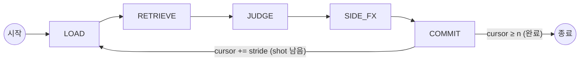
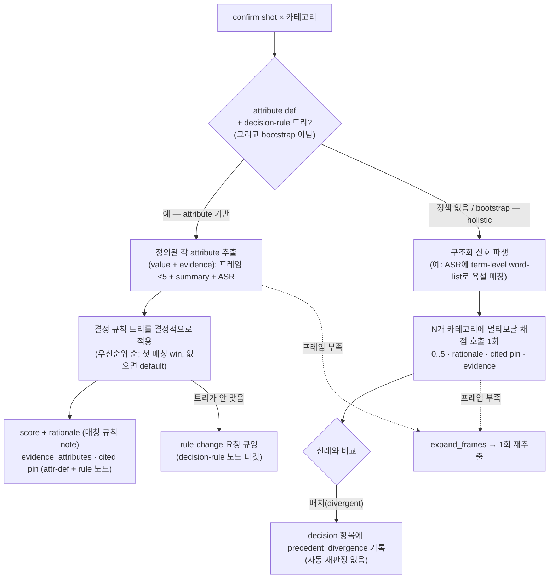

# 에이전트 워크플로 (Agent Workflow)

*언어: [English](AGENT_WORKFLOW.md) · **한국어***

labelling 에이전트는 **LangGraph 상태 머신**이다 — 고정된 단계(stage)들이 각각
제한된 도구 집합을 가지며, 자유로운 ReAct가 **아니다**. shot window가 영상 위를
슬라이딩하며 모든 shot이 라벨링될 때까지 진행한다. 전역 영상 컨텍스트와 롤링
carry-over 요약이 항상 주입된다.

이전 초안의 `DERIVE`와 `CHECK`는 **JUDGE로 흡수**되었다: 합성된 정책이 있는
카테고리는 JUDGE가 정의된 attribute를 추출하고 결정 규칙 트리를 적용한다. 아직
holistic 폴백인 카테고리는 판정 단계 안에서 구조화 신호를 파생하고 선례 일관성을
체크한다. `SIDE_FX`는 유지된다.

## Orchestrator 모델

Orchestrator는 config의 `agent_llm` 역할로 선택되는 **멀티모달 LLM**이다(config
기반, 교체 가능). 현재는 **Gemini 3.5 Flash**(API). 향후 shot의 raw 오디오를
입력으로 추가할 수 있도록 **오디오 가능 모델**을 의도적으로 선택했다.

인지(perception)는 **가볍게** 유지한다: 모델은 clip 전체를 보지 않는다. shot마다
**uniform 샘플링된 프레임 ≤ 5장** + coarse `summary` + 해당 shot의 ASR 텍스트를
받는다. 프레임이 부족하면 에이전트는 **`expand_frames`**를 호출해 추가/조밀한
프레임을 요청할 수 있다.

> **알려진 공백 (GitHub issue로 추적):** raw **오디오는 아직 orchestrator에
> 입력되지 않는다** — 음성은 ASR 텍스트로만 대체된다. raw shot 오디오를 JUDGE에
> 배선하는 작업은 per-run trace 플래그가 아니라 **저장소 issue**로 추적한다.

## Window

`config/config.yaml → labelling`에서:

- `window_size = 5` — 스텝당 보이는 shot 수 (confirm shot + 이웃 컨텍스트)
- `window_stride = 3` — 스텝당 확정(commit)되는 shot 수 (overlap = size − stride = 2)
- `carry_over = rolling_summary` — 확정 판정들의 러닝 요약. 항상 존재하는
  `global_overview`와 함께 매 스텝 주입됨

## 카테고리는 파라미터화

카테고리 집합은 **하드코딩하지 않는다.** 활성 정책 세트(`config
policy.categories`, 현재 gambling / bad_language / sex)에서 N-길이 리스트로
주입된다. 프롬프트와 코드가 이 리스트를 순회하므로, 카테고리 추가/제거는
코드 변경이 아니라 config/정책 변경이다. N개 카테고리는 shot당 **한 번의
패스**로 판정한다.

## 단계 (Stages)

### LOAD
`all_segments[cursor : cursor + window_size]`에서 `window`를 구성한다. 앞쪽
`window_stride`개 shot이 **confirm** shot(이번 스텝에 commit)이고, 나머지는 이웃
컨텍스트다. 각 shot의 `[t_start, t_end]`와 겹치는 `utterances`를 ASR 텍스트로
병합한다. `clip_blob`에서 confirm shot마다 uniform 프레임 ≤ 5장을 샘플링한다.
디버깅용 run-scoped 스텝 `tool_trace`를 매 스텝 초기화하지만, 이는 라벨이 담는
것이 **아니다** — 라벨의 감사 기록은 JUDGE(아래)에서 설정된다. 도구: storage 읽기,
프레임 샘플러.

### RETRIEVE
- `search_policies` — 활성 카테고리의 정책 노드(scoring 루브릭 / attribute
  definition / decision rule / edge-case)에 대한 hybrid(pgvector dense + BM25)
  검색.
- `find_similar_segments` — 가장 유사한 shot + **그 확정 라벨**(선례 조회; 주된
  일관성 신호).

도구: retrieval 전용.

### JUDGE  *(DERIVE + CHECK 흡수)*
판정은 **confirm shot마다, 카테고리마다** 이뤄지며, 카테고리에 합성된 정책이
있는지에 따라 두 경로 중 하나를 탄다:

**Attribute 기반 경로**(카테고리에 ATTRIBUTE definition + DECISION_RULE 트리 존재):
카테고리당 추출 호출 1회가 정의된 각 attribute를 닫힌 enum / ordinal에 맞춰
value + evidence로 해석하고, 이후 트리를 코드에서 **결정적으로** 적용한다(채점
호출 없음). 첫 완전 매칭 규칙의 score가 win, 없으면 트리 default. orchestrator가
트리가 안 맞는다고 표시하면(또는 아무것도 매칭 안 되고 gap을 보고하면) JUDGE는
그 decision-rule 노드를 타깃으로 **rule-change 요청을 큐잉**한다 — 큐잉만, 자동
적용 없음.

**Holistic 폴백**(합성된 정책이 없는 카테고리, 그리고 bootstrap 중의 *모든*
카테고리): 멀티모달 호출 1회가 프레임 + summary + ASR에서 직접 카테고리를 채점하며,
먼저 구조화 term-level 신호를 파생하고 선례 divergence를 decision 항목에 기록한다.

구조화 출력은 **강제하지 않는다**; 모델이 반환한 JSON 유사 텍스트를 관대하게
파싱한다. 일관성 divergence는 자동 보정하지 않고 **기록**된다.
도구: `sample_frames` / `expand_frames`, `search_policies` 결과, 정책 트리,
orchestrator 호출.

### SIDE_FX
JUDGE가 만든 proposal을 shape별로 dispatch한다(여기서만 도달 가능):
- `propose_policy_change` — **항상** human 승인 대기 큐로; 자동 적용되지 않는다.
  attribute 기반 **rule-change 요청**(`node_type=decision_rule`,
  `target_policy_id` = 규칙 노드)과 bootstrap 자유 텍스트 gap 제안
  (`node_type` = attribute / edge_case)을 모두 포함한다.
- `define_structured_attribute` — **bootstrap 전용 직접 upsert**로 구조화
  term-level ATTRIBUTE 노드를 초안 작성(human 게이트 없음; 전체 초안 트리는
  policy-set v1 스냅샷 전에 검토됨).

승인 시 큐잉된 요청은 해당 카테고리의 scoring 루브릭 아래 ATTRIBUTE / EDGE_CASE
노드로 **materialise**된다(`resolve_change_request`). 편집된 attribute나 summary에
대한 콘텐츠 변경 이력(revision log)은 계획된 후속 작업이며 아직 구현되지 않았다.

### COMMIT
각 draft `Label`을 저장(`storage.save_label`)하고 롤링 `carry_over` 요약을
갱신한다. `cursor += window_stride`; `cursor < len(all_segments)`면 LOAD로 루프,
아니면 END.

## Issues 로그

라벨별 rationale 외에, holistic 경로는 점수가 유사 shot의 확정 라벨과 크게
어긋날 때 라벨의 compact `decision` 항목 안에 **precedent_divergence**를
기록한다 — human manager가 group화해 분류(triage)하도록 보존되며 자동 보정되지
않는다. (오디오 입력 부재 같은 더 큰 기능 공백은 per-run trace가 아니라 **저장소
issue**로 추적한다.)

## 출력 계약(Output contract)

판정된 각 shot은 `Label` row를 만든다(`packages/schemas` 참고): `category`,
`score`, `rationale`, `cited_policy_ids`, `evidence_attributes`,
`used_segment_ids`, `tool_trace`, `confidence`. 라벨의 감사 기록은
**evidence_attributes**(추출된 attribute + evidence + attribute 노드의 version),
정규 `(policy_id, version)` pin인 **cited_policy_ids**(attribute-def 노드 + 규칙
노드, 환각 id는 제거되고 실제 version이 재부착됨), 그리고 rationale에 담긴 매칭
규칙 note다. `tool_trace`에는 단일 compact `{"decision": …}` 항목만 남는다 —
이전의 장황한 stage/tool 덤프는 제거됨. 이 pin들은 `policy_versions` 히스토리를
통해 사용된 정확한 텍스트로 해석되어 모든 라벨을 재현·감사 가능하게 만든다.
