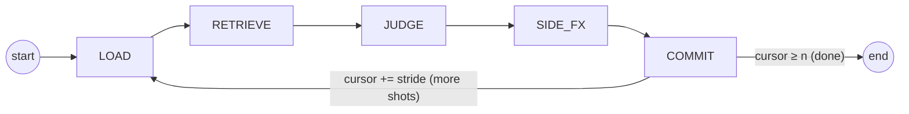
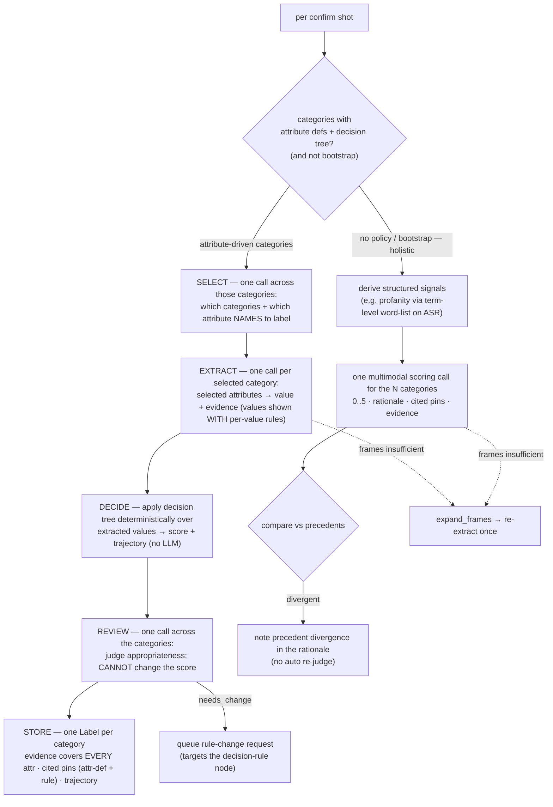

# Agent Workflow

*Language: **English** · [한국어](AGENT_WORKFLOW.ko.md)*

The labelling agent is a **LangGraph state machine** — fixed stages, each with a
restricted tool set, **not** free-form ReAct. A shot window slides over the video
until every shot is labelled. Global video context and a rolling carry-over
summary are always injected.

`DERIVE` and `CHECK` from the earlier draft are **absorbed into JUDGE**: for a
category with a synthesised policy, JUDGE runs an explicit **SELECT → EXTRACT →
DECIDE → REVIEW → STORE** pipeline (the tree produces the score deterministically;
REVIEW checks appropriateness but cannot override it); for categories still on the
holistic fallback it derives any structured signals and checks precedent
consistency inside the judging step. `SIDE_FX` is retained.

## Orchestrator model

The orchestrator is a **multimodal LLM** selected by the config `agent_llm` role
(config-driven, swappable). It is currently **Gemini 3.5 Flash** (API). An
audio-capable model is chosen deliberately so raw shot audio can be added as an
input later without changing the workflow.

Perception is kept **light**: the model does not watch the full clip. Per shot it
receives **≤ 5 uniformly-sampled frames** + the coarse `summary` + the shot's ASR
text. When those frames are insufficient the agent may call **`expand_frames`**
to request additional / denser frames for a shot.

> **Known gap (tracked as a GitHub issue):** raw **audio is not yet fed** to
> the orchestrator — only ASR text stands in for speech. Wiring raw shot audio
> into JUDGE is tracked as a repository issue, not a per-run trace flag.

## Window

From `config/config.yaml → labelling`:

- `window_size = 5` — shots visible per step (the confirm shots + neighbour context)
- `window_stride = 3` — shots committed per step (overlap = size − stride = 2)
- `carry_over = rolling_summary` — a running summary of confirmed judgements,
  injected each step alongside the always-present `global_overview`

## Categories are parameterised

The category set is **not hardcoded**. It is injected from the active policy set
(`config policy.categories`, currently gambling / bad_language / sex) as an
N-length list. Prompts and code iterate over that list, so adding or removing a
category is a config/policy change, not a code change. All N categories are
judged in a **single pass** per shot.

## Stages

### LOAD
Populate `window` from `all_segments[cursor : cursor + window_size]`; the head
`window_stride` shots are the **confirm** shots (committed this step), the rest
are neighbour context. Merge `utterances` overlapping each shot's `[t_start,
t_end]` into its ASR text. Sample ≤ 5 uniform frames per confirm shot from
`clip_blob`. A run-scoped stage `tool_trace` is reset per step for debugging; it
is **not** what a label carries — a label's audit trail is set in JUDGE (below).
Tools: storage reads, frame sampler.

### RETRIEVE
- `search_policies` — hybrid (pgvector dense + BM25) over the policy nodes for
  the active categories (scoring rubric / attribute definitions / decision rule /
  edge-case).
- `find_similar_segments` — nearest shots + **their confirmed labels**
  (precedent lookup; the primary consistency signal).

Tools: retrieval only.

### JUDGE  *(absorbs DERIVE + CHECK)*
Judging is **per confirm shot**. Categories that have a synthesised policy
(ATTRIBUTE definitions **and** a DECISION_RULE tree, and not bootstrap) run the
attribute-driven **SELECT → EXTRACT → DECIDE → REVIEW → STORE** pipeline; the rest
(no synthesised policy, and *every* category during bootstrap) keep the holistic
fallback. Frames (≤5) are sampled **once per shot** and reused across every call.

**Attribute-driven pipeline** (categories with ATTRIBUTE definitions + a
DECISION_RULE tree):
- **SELECT** — one orchestrator call across all attribute-driven categories,
  showing each category with its attribute **names only**. It returns which
  categories are relevant and, per category, which attributes to label. A
  category/attribute the agent omits is **not** labelled — its attributes are
  treated as empty and the tree runs without them (empty-safe → typically the
  default score, 0 = absent). Parsing keeps only known category/attribute names.
- **EXTRACT** — one call per selected category resolving **only** the selected
  attributes to a value + evidence obeying its closed enum / ordinal; each
  attribute's allowed values are rendered **with their per-value edge-case rules**.
  A category with no selected attributes skips its EXTRACT call.
- **DECIDE** — the tree is applied **deterministically** in the code (no LLM
  call) over only the extracted values → a `score` and a **trajectory**
  (`{selected, extracted, rule_index, rule_note, score}`) used in-process to
  drive the REVIEW prompt, the rationale, and the score. It is **not** persisted.
- **REVIEW** — one call across the categories, injecting each category's score +
  trajectory. The model judges appropriateness but **cannot change the score**; if
  it flags `needs_change`, JUDGE **queues a rule-change request** targeting that
  decision-rule node — queued, never auto-applied.
- **STORE** — one Label per category. `evidence_attributes` includes **every**
  defined attribute: selected+extracted ones carry their value + evidence
  (`source=judge/extract`); unselected/empty ones are stored with an EMPTY value
  (`value=""`, `evidence=None`, `source=judge/unselected`) so "considered-and-empty"
  is distinguishable downstream. Cited pins = all attr-def nodes + the rule node;
  rationale is the matched-rule note. **No per-label `tool_trace` is stored** —
  the fired rule is re-derived on demand from `evidence_attributes` (see
  *Node → segment tracking* below).

**Holistic fallback** (a category with no synthesised policy, and *every* category
during bootstrap): a single multimodal call scores the categories directly from
frames + summary + ASR, deriving any structured term-level signals first and
noting precedent divergence **in the rationale**.

Structured output is **not** forced; the model returns JSON-ish text parsed
leniently. Consistency divergences are **recorded**, not auto-corrected.
Tools: `sample_frames` / `expand_frames`, `search_policies` results, the policy
tree, orchestrator call.

### SIDE_FX
Dispatches the proposals JUDGE produced, by shape (reachable only from here):
- `propose_policy_change` — **always queued** for human approval; never
  auto-applied. Covers both attribute-driven **rule-change requests**
  (`node_type=decision_rule`, `target_policy_id` = the rule node) and bootstrap
  free-text gap proposals (`node_type` = attribute / edge_case).
- `define_structured_attribute` — a **bootstrap-only direct upsert** drafting a
  structured term-level ATTRIBUTE node (not human-gated; the whole draft tree is
  reviewed before the policy-set v1 snapshot).

On approval a queued request **materialises** into an ATTRIBUTE / EDGE_CASE node
under the category's scoring rubric (`resolve_change_request`). A content
change-history / revision log for edited attributes or summaries is a planned
follow-up, not yet built.

### COMMIT
Persist each draft `Label` (`storage.save_label`) and update the rolling
`carry_over` summary. Advance `cursor += window_stride`; loop to LOAD while
`cursor < len(all_segments)`, else END.

## Node → segment tracking

A reviewer can click a policy node and see which segments were labelled through
it (`tools.tracking`, read-only, nothing stored):
- **attribute value → segments** (`segments_for_attribute_value`) — matches any
  label whose `evidence_attributes` carries that key/value.
- **decision-tree rule → segments** (`segments_for_rule`) — because labels store
  **no** trace, the fired rule is **re-derived**: for each of the category's
  labels, `values` is rebuilt from its non-empty `evidence_attributes`, the
  category's **current** decision tree is re-applied via the shared, DB-free
  `tools.decision_tree` module (the exact code the agent scored with), and the
  segment is kept when the matched rule's index equals the requested one.

## Issues log

Beyond the per-label rationale, the holistic route notes **precedent divergence**
in the label's rationale when a score disagrees sharply with similar shots'
confirmed labels — retained for a human manager to group and triage, never
auto-corrected. (Broader capability gaps such as missing audio input are tracked
as **repository issues**, not per-run trace notes.)

## Output contract

Each judged shot yields `Label` rows (see `packages/schemas`): `category`,
`score`, `rationale`, `cited_policy_ids`, `evidence_attributes`,
`used_segment_ids`, `confidence`. A label's audit trail is its
**evidence_attributes** (extracted attributes with evidence + the attribute
node's version), its **cited_policy_ids** as canonical `(policy_id, version)` pins
(attribute-def nodes + the rule node, hallucinated ids dropped and true versions
re-attached), and the matched-rule note carried in the **rationale**. Labels
carry **no per-label `tool_trace`** (the column is kept but stored empty `[]`);
the fired decision-tree rule is re-derived from `evidence_attributes` when
needed (Node → segment tracking). Those pins resolve through the
`policy_versions` history to the exact text used, making every label
reproducible and auditable.
