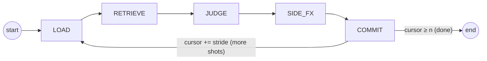
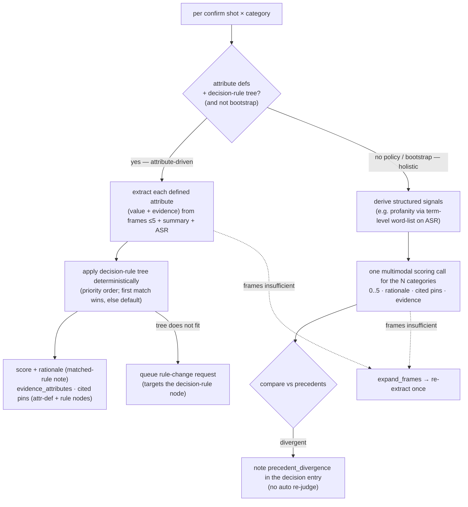

# Agent Workflow

*Language: **English** · [한국어](AGENT_WORKFLOW.ko.md)*

The labelling agent is a **LangGraph state machine** — fixed stages, each with a
restricted tool set, **not** free-form ReAct. A shot window slides over the video
until every shot is labelled. Global video context and a rolling carry-over
summary are always injected.

`DERIVE` and `CHECK` from the earlier draft are **absorbed into JUDGE**: for a
category with a synthesised policy, JUDGE extracts the defined attributes and
applies its decision-rule tree; for categories still on the holistic fallback it
derives any structured signals and checks precedent consistency inside the
judging step. `SIDE_FX` is retained.

## Orchestrator model

The orchestrator is a **multimodal LLM** selected by the config `agent_llm` role
(config-driven, swappable). It is currently **Gemini 3.5 Flash** (API). An
audio-capable model is chosen deliberately so raw shot audio can be added as an
input later without changing the workflow.

Perception is kept **light**: the model does not watch the full clip. Per shot it
receives **≤ 5 uniformly-sampled frames** + the coarse `summary` + the shot's ASR
text. When those frames are insufficient the agent may call **`expand_frames`**
to request additional / denser frames for a shot.

> **Known gap (tracked as a GitHub issue):** raw **audio is not yet fed** to
> the orchestrator — only ASR text stands in for speech. Wiring raw shot audio
> into JUDGE is tracked as a repository issue, not a per-run trace flag.

## Window

From `config/config.yaml → labelling`:

- `window_size = 5` — shots visible per step (the confirm shots + neighbour context)
- `window_stride = 3` — shots committed per step (overlap = size − stride = 2)
- `carry_over = rolling_summary` — a running summary of confirmed judgements,
  injected each step alongside the always-present `global_overview`

## Categories are parameterised

The category set is **not hardcoded**. It is injected from the active policy set
(`config policy.categories`, currently gambling / bad_language / sex) as an
N-length list. Prompts and code iterate over that list, so adding or removing a
category is a config/policy change, not a code change. All N categories are
judged in a **single pass** per shot.

## Stages

### LOAD
Populate `window` from `all_segments[cursor : cursor + window_size]`; the head
`window_stride` shots are the **confirm** shots (committed this step), the rest
are neighbour context. Merge `utterances` overlapping each shot's `[t_start,
t_end]` into its ASR text. Sample ≤ 5 uniform frames per confirm shot from
`clip_blob`. A run-scoped stage `tool_trace` is reset per step for debugging; it
is **not** what a label carries — a label's audit trail is set in JUDGE (below).
Tools: storage reads, frame sampler.

### RETRIEVE
- `search_policies` — hybrid (pgvector dense + BM25) over the policy nodes for
  the active categories (scoring rubric / attribute definitions / decision rule /
  edge-case).
- `find_similar_segments` — nearest shots + **their confirmed labels**
  (precedent lookup; the primary consistency signal).

Tools: retrieval only.

### JUDGE  *(absorbs DERIVE + CHECK)*
Judging is **per confirm shot, per category**, and takes one of two routes
depending on whether the category has a synthesised policy:

**Attribute-driven route** (category has ATTRIBUTE definitions + a DECISION_RULE
tree): one extraction call per category resolves each defined attribute to a
value + evidence obeying its closed enum / ordinal, then the tree is applied
**deterministically** in the code (no scoring call). The first fully-matching
rule's score wins, else the tree default. If the orchestrator flags the tree does
not fit (or nothing matched and it reports a gap), JUDGE **queues a rule-change
request** targeting that decision-rule node — queued, never auto-applied.

**Holistic fallback** (a category with no synthesised policy, and *every* category
during bootstrap): a single multimodal call scores the categories directly from
frames + summary + ASR, deriving any structured term-level signals first and
noting precedent divergence in the decision entry.

Structured output is **not** forced; the model returns JSON-ish text parsed
leniently. Consistency divergences are **recorded**, not auto-corrected.
Tools: `sample_frames` / `expand_frames`, `search_policies` results, the policy
tree, orchestrator call.

### SIDE_FX
Dispatches the proposals JUDGE produced, by shape (reachable only from here):
- `propose_policy_change` — **always queued** for human approval; never
  auto-applied. Covers both attribute-driven **rule-change requests**
  (`node_type=decision_rule`, `target_policy_id` = the rule node) and bootstrap
  free-text gap proposals (`node_type` = attribute / edge_case).
- `define_structured_attribute` — a **bootstrap-only direct upsert** drafting a
  structured term-level ATTRIBUTE node (not human-gated; the whole draft tree is
  reviewed before the policy-set v1 snapshot).

On approval a queued request **materialises** into an ATTRIBUTE / EDGE_CASE node
under the category's scoring rubric (`resolve_change_request`). A content
change-history / revision log for edited attributes or summaries is a planned
follow-up, not yet built.

### COMMIT
Persist each draft `Label` (`storage.save_label`) and update the rolling
`carry_over` summary. Advance `cursor += window_stride`; loop to LOAD while
`cursor < len(all_segments)`, else END.

## Issues log

Beyond the per-label rationale, the holistic route records **precedent_divergence**
inside the label's compact `decision` entry when a score disagrees sharply with
similar shots' confirmed labels — retained for a human manager to group and
triage, never auto-corrected. (Broader capability gaps such as missing audio
input are tracked as **repository issues**, not per-run trace notes.)

## Output contract

Each judged shot yields `Label` rows (see `packages/schemas`): `category`,
`score`, `rationale`, `cited_policy_ids`, `evidence_attributes`,
`used_segment_ids`, `tool_trace`, `confidence`. A label's audit trail is its
**evidence_attributes** (extracted attributes with evidence + the attribute
node's version), its **cited_policy_ids** as canonical `(policy_id, version)` pins
(attribute-def nodes + the rule node, hallucinated ids dropped and true versions
re-attached), and the matched-rule note carried in the rationale. `tool_trace`
keeps only a single compact `{"decision": …}` entry — the old verbose per-stage /
per-tool dump was removed. Those pins resolve through the `policy_versions`
history to the exact text used, making every label reproducible and auditable.
