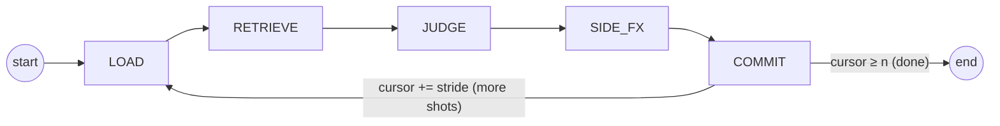
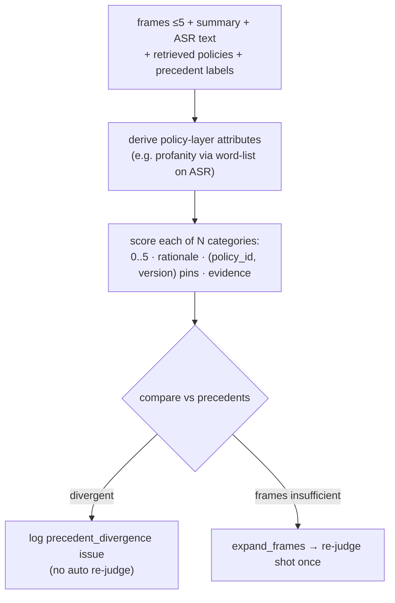

# Agent Workflow

*Language: **English** · [한국어](AGENT_WORKFLOW.ko.md)*

The labelling agent is a **LangGraph state machine** — fixed stages, each with a
restricted tool set, **not** free-form ReAct. A shot window slides over the video
until every shot is labelled. Global video context and a rolling carry-over
summary are always injected.

`DERIVE` and `CHECK` from the earlier draft are **absorbed into JUDGE** (policy
attributes are derived and precedent consistency is checked inside the judging
step). `SIDE_FX` is retained.

## Orchestrator model

The orchestrator is a **multimodal LLM** selected by the config `agent_llm` role
(config-driven, swappable). It is currently **Gemini 3.5 Flash** (API). An
audio-capable model is chosen deliberately so raw shot audio can be added as an
input later without changing the workflow.

Perception is kept **light**: the model does not watch the full clip. Per shot it
receives **≤ 5 uniformly-sampled frames** + the coarse `summary` + the shot's ASR
text. When those frames are insufficient the agent may call **`expand_frames`**
to request additional / denser frames for a shot.

> **Known gap (tracked as a GitHub issue):** raw **audio is not yet fed** to
> the orchestrator — only ASR text stands in for speech. Wiring raw shot audio
> into JUDGE is tracked as a repository issue, not a per-run trace flag.

## Window

From `config/config.yaml → labelling`:

- `window_size = 5` — shots visible per step (the confirm shots + neighbour context)
- `window_stride = 3` — shots committed per step (overlap = size − stride = 2)
- `carry_over = rolling_summary` — a running summary of confirmed judgements,
  injected each step alongside the always-present `global_overview`

## Categories are parameterised

The category set is **not hardcoded**. It is injected from the active policy set
(`config policy.categories`, currently gambling / bad_language / sex) as an
N-length list. Prompts and code iterate over that list, so adding or removing a
category is a config/policy change, not a code change. All N categories are
judged in a **single pass** per shot.

## Stages

### LOAD
Populate `window` from `all_segments[cursor : cursor + window_size]`; the head
`window_stride` shots are the **confirm** shots (committed this step), the rest
are neighbour context. Merge `utterances` overlapping each shot's `[t_start,
t_end]` into its ASR text. Sample ≤ 5 uniform frames per confirm shot from
`clip_blob`. Reset a fresh `tool_trace` for the step. Tools: storage reads,
frame sampler.

### RETRIEVE
- `search_policies` — hybrid (pgvector dense + BM25) over the policy nodes for
  the active categories (rubric / attribute / edge-case).
- `find_similar_segments` — nearest shots + **their confirmed labels**
  (precedent lookup; the primary consistency signal).

Tools: retrieval only.

### JUDGE  *(absorbs DERIVE + CHECK)*
A single multimodal call per confirm shot to the orchestrator, then bookkeeping:

Structured output is **not** forced; the model returns JSON-ish text that is
parsed leniently. Consistency divergences are **recorded as issues** for a human
manager to group and adjudicate later — never auto-corrected.
Tools: `expand_frames`, `lookup_structured`, orchestrator call.

### SIDE_FX
Reachable side effects (only from here):
- `revise_ingestion` — auto-applied correction to ingestion output; the original
  is preserved with a revision log.
- `propose_policy_change` — **always queued** for human approval; never
  auto-applied.

### COMMIT
Persist each draft `Label` (`storage.save_label`) and update the rolling
`carry_over` summary. Advance `cursor += window_stride`; loop to LOAD while
`cursor < len(all_segments)`, else END.

## Issues log

Beyond the per-label rationale, the agent records **issues** — structured notes
for human review — into the trace, e.g. `precedent_divergence` and
low-confidence judgements. These are meant to be **grouped and triaged by a
human manager**, not acted on automatically. (Broader capability gaps such as
missing audio input are tracked as **repository issues**, not per-run trace notes.)

## Output contract

Each judged shot yields `Label` rows (see `packages/schemas`): `category`,
`score`, `rationale`, `cited_policy_ids`, `evidence_attributes`,
`used_segment_ids`, `tool_trace`, `confidence`. The `(policy_id, version)` pins
plus the trace make every label reproducible and auditable.
