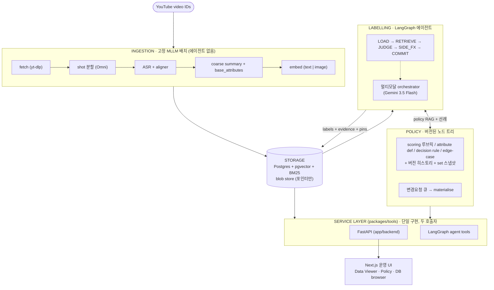
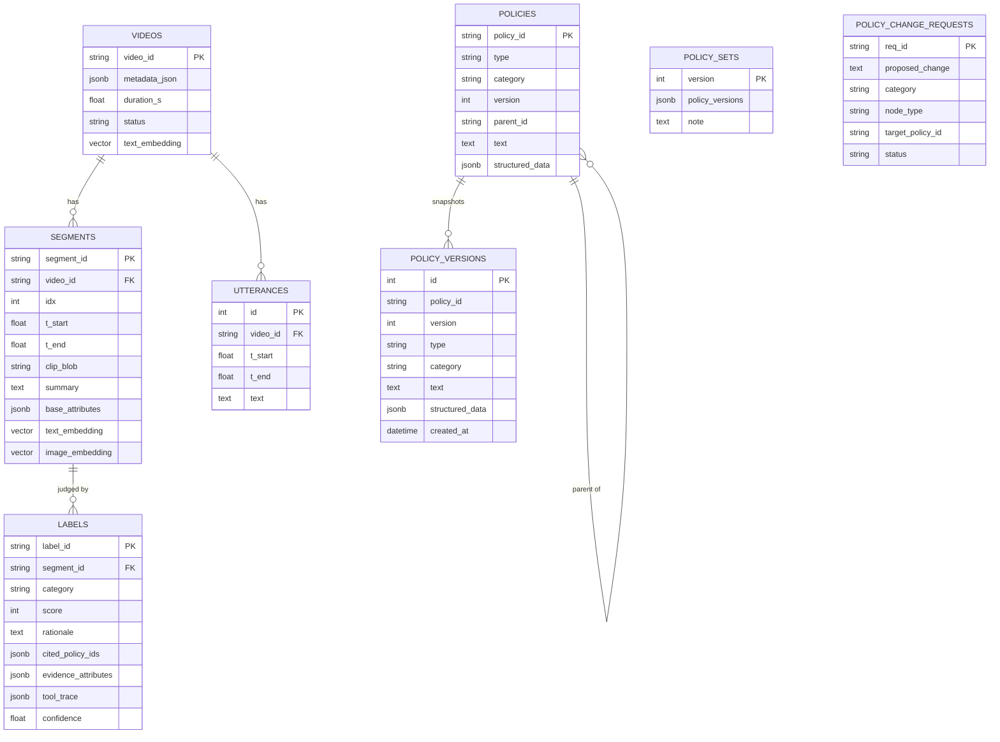
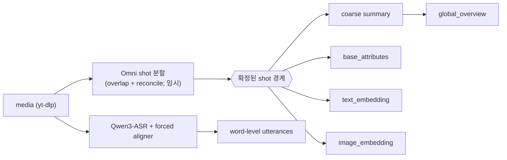
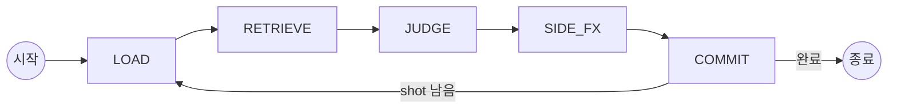
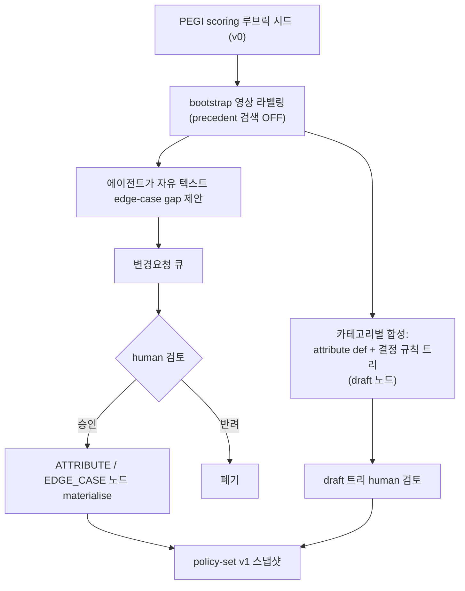

# 아키텍처 (Architecture)

*언어: [English](ARCHITECTURE.md) · **한국어***

**게임플레이 영상 콘텐츠 모더레이션**을 위한 에이전트 기반 자동 라벨링 시스템(PoC).
영상은 **shot(segment) 단위**로 판정되며, 최우선 목표는 **일관적(consistent) +
근거 추적(traceable)** 가능한 라벨이다. PoC 범위: PEGI 서브셋
**도박 / 저속어 / 성적 표현**, 연령 스코어 **0–5**.

상세: **[DATA_FLOW.ko.md](DATA_FLOW.ko.md)** · **[AGENT_WORKFLOW.ko.md](AGENT_WORKFLOW.ko.md)**.

## 한눈에 보기



**두 축, storage로만 연결.** `ingestion/`은 에이전트 없는 고정 MLLM 배치로 shot
경계를 확정하고 `summary + base_attributes + embeddings`를 만든다. `labelling/`은
이를 읽고 판정하는 에이전트다. 서로 직접 호출하지 않고 Postgres + blob store로만
연결된다. **단일 서비스 계층, 두 호출자:** 실제 로직은 `packages/tools`에 있고
FastAPI 라우터와 에이전트 tool이 같은 함수를 호출한다.

## 저장소 구조

| 경로 | 역할 |
|------|------|
| `packages/schemas` | 모든 계층이 공유하는 Pydantic 도메인 계약 |
| `packages/models` | provider 추상화(`providers.py`) + config/profile 로더; **config 기반 provider 분기** |
| `packages/tools` | 서비스 계층: `storage`·`blob`·`embeddings`·`retrieval`·`policy_store`·`db_browser` |
| `ingestion` | 고정 파이프라인: 분할·ASR·summary·base attribute·임베딩 |
| `labelling` | LangGraph 에이전트: `graph.py`(상태머신)·`state.py`·`tools.py` |
| `policy` | `bootstrap.py` — PEGI 루브릭 시드 + 미라벨 데이터로 정책 세트 초안 |
| `app/backend` | 서비스 계층 위의 FastAPI HTTP 표면 |
| `app/ui` | Next.js 운영 콘솔 |
| `db` | SQLAlchemy 모델 + Alembic 마이그레이션 |
| `config` | `config.yaml`(기본 파라미터) + `profiles/<MODEL_PROFILE>.yaml`(역할별 모델) |

## 데이터 모델



저장 규칙: **Postgres**는 관계형 row + `pgvector` dense 임베딩(text 2560 / image
2048) + BM25 functional GIN 인덱스를 담고, **blob store**는 media/clip/keyframe/
thumbnail을 담으며 DB엔 포인터만 둔다. Attribute는 2계층 — `base`(ingestion, 정책
무관) vs `policy`(에이전트 파생). 모든 `Label`은 사용한 `(policy_id, version)`을
pin하고, `policy_versions`가 그 pin을 정확한 텍스트까지 재현 가능하게 한다.

## Ingestion (고정, 에이전트 없음)



경계는 여기서 확정된다(에이전트는 바꾸지 않음). Omni 분할기는 향후 전용 shot-cut
모델로 교체될 의도적 placeholder다. `base_attributes`는 이미 생성된 데이터에서
계산하는 모델 없는 사실이다(`has_speech`, `shot_seconds`, `asr_word_count`,
`summary_len`) — 더 이상 공백이 아니다. ASR은 수집된 메타데이터에서 온 **언어
힌트**(ISO 코드 → 정식 영어 이름)를 받아 auto-detect가 비영어 오디오를 오분류하지
않도록 한다.

## Labelling 에이전트 (LangGraph)



shot window가 슬라이딩(`size 5 / stride 3`)하며 롤링 carry-over 요약과 항상 주입되는
global overview를 함께 쓴다. **JUDGE**는 shot × 카테고리마다 두 경로 중 하나를
탄다: **attribute definition + 결정 규칙 트리**가 있는 카테고리는 정의된 각
attribute를 ≤5 프레임 + summary + ASR에서 추출(value + evidence)한 뒤 트리를
**결정적으로** 적용해 점수를 낸다. 합성된 정책이 없는 카테고리 — 그리고 bootstrap
중의 모든 카테고리 — 는 **holistic 멀티모달 폴백**(채점 호출 1회)을 쓴다. 라벨의
provenance는 `evidence_attributes`, 정규 `(policy_id, version)` pin, 매칭 규칙
note이며, `tool_trace`에는 compact `decision` 항목만 남는다. 단계/도구 상세는
[AGENT_WORKFLOW.ko.md](AGENT_WORKFLOW.ko.md) 참고.

## 정책 트리 & bootstrap 루프

한 카테고리의 정책은 카테고리 루트 아래 각각 버전된 세 부분이다: **scoring
루브릭**(SCORING), **attribute definition**(ATTRIBUTE — 일반적 관측 신호: 값별
label/description/examples를 가진 닫힌 enum 또는 ordinal, 탐지 guideline, 그리고
정보를 주는 score 밴드; `structured_data.kind = attribute_def`), **결정 규칙
트리**(DECISION_RULE — `structured_data.kind = decision_tree`, `default`와
우선순위 순 `rules`; 첫 완전 매칭 규칙 win, 없으면 default), 그리고 점진적
EDGE_CASE 노드. 모든 노드는 버전되며 편집마다 `policy_versions` 스냅샷을 append하여
라벨의 `(policy_id, version)` pin이 정확한 텍스트를 재현한다.



bootstrap은 확정 라벨이 없으므로 cross-data 검색을 끈 채 일반 에이전트 루프를
재사용하며, scoring 루브릭만 시드된다. bootstrap 영상 탐색 후
`synthesize_category_policy`가 **관측된 segment로부터** 각 카테고리의 attribute
definition + 결정 규칙 트리를 초안 작성한다 — 직접 draft 쓰기이며 policy-set v1
스냅샷 전에 human 검토를 거친다. 자유 텍스트 edge-case 제안은 **항상** human
게이트를 거치며, 승인 시 해당 카테고리의 scoring 루브릭 아래 실제 ATTRIBUTE /
EDGE_CASE 노드로 materialise된다.

## 모델 역할 & provider

역할별 모델은 `config/profiles/<MODEL_PROFILE>.yaml`에서 선택되고,
`packages/models/providers.py`의 factory가 **역할의 `provider`로 분기**하며 이 PoC에
미배선된 provider는 명확한 에러를 낸다. `local`이 배선된 기본값이다.

| 역할 | provider | 모델(local) | 비고 |
|------|----------|-------------|------|
| `mllm` | vllm | Qwen3-Omni-30B-A3B-Instruct | shot 분할 + summary; vllm-omni로 서빙(오디오 가능) |
| `asr` | vllm | Qwen3-ASR-1.7B + ForcedAligner | word-level 전사 |
| `text_embedding` | vllm | Qwen3-Embedding-4B | dim 2560 (DB 일치) |
| `image_embedding` | vllm | Qwen3-VL-Embedding-2B | dim 2048 (DB 일치) |
| `agent_llm` | google-genai | Gemini 3.5 Flash | 라벨링 orchestrator(멀티모달) |

## API 표면 (FastAPI)

| 엔드포인트 | 용도 |
|-----------|------|
| `GET /api/videos?search=&page=&page_size=` | 페이징 갤러리(title/duration/thumbnail/n_segments) |
| `GET /api/videos/{id}` · `/segments` · `/thumbnail` | 영상 상세·shot·JPEG 썸네일 |
| `GET /api/labels?segment_id=` | evidence attribute + policy pin 포함 label |
| `GET /api/policies?category=` · `GET /api/policy-sets` | 정책 트리 + set 버전 |
| `GET/POST /api/policy-change-requests[/{id}/resolve]` | 검토 큐; 승인 → materialise |
| `GET /api/db/tables[/{name}]` | 읽기전용 DB 브라우저(vector 컬럼 요약) |
| `POST /api/ingest` · `POST /api/label` · `GET /api/runs/{id}` | 파이프라인 실행 |
| `POST /api/search/{policies,segments,qa}` · `GET /api/metrics,/queue,/consistency` | 검색 + 모니터링 |

## Web UI (Next.js)

- **Data Viewer** (`/viewer`, `/viewer/[video_id]`) — 검색/페이징 갤러리 → YouTube
  임베드 + 카테고리별 구간 타임라인 + label trace.
- **Policy** (`/policy`) — 버전된 트리 + policy-set 목록 + 변경요청 큐.
- **DB browser** (`/db`) — 페이징 읽기전용 테이블 탐색기.

## 설치 & 실행

```bash
pip install -e ".[dev]"                                 # flat import (pyproject 참고)
docker compose up -d postgres                           # 또는 로컬 Postgres
alembic -c db/alembic.ini upgrade head                  # 스키마
bash scripts/serve_vllm.sh                              # 로컬 모델 서버(GPU)
bash scripts/run_backend.sh                            # backend :8000 (neutral app-dir)
cd app/ui && npm install && npm run dev                 # UI :3000
pytest                                                  # 45개 helper 테스트
```

`MODEL_PROFILE=local`이 배선된 프로파일이며, Gemini orchestrator용
`GENAI_API_KEY`를 설정한다. `regular`는 미배선 proprietary 템플릿이다.

**관측성(선택).** `LANGFUSE_PUBLIC_KEY` + `LANGFUSE_SECRET_KEY`(셀프호스팅은
`LANGFUSE_HOST`도)가 설정되면 labelling이 **Langfuse**로 추적된다 —
`label_video` 실행마다 trace 1개, LangGraph 노드마다 span, 그리고 LangChain을
거치지 않는 직접 SDK 호출(Gemini orchestrator, GPT policy author)마다 중첩된
generation span. env가 없으면 `models.tracing`은 no-op으로 동작하며 아무것도
전송하지 않는다(`packages/models/tracing.py`).

## 테스트

`tests/`는 순수(DB/모델 무관) helper를 커버한다 — score clamp, 관대한 JSON 파싱,
ASR 병합, window cursor/route, retrieval fusion, word-list 조회 — flat-package의
`db` 네임스페이스 shadow는 `conftest.py`가 해결한다. Consistency **검증**(cross-
sample + 재현성 지표)은 의도적으로 PoC 마지막 마일스톤이라 현재 stub 상태다.
