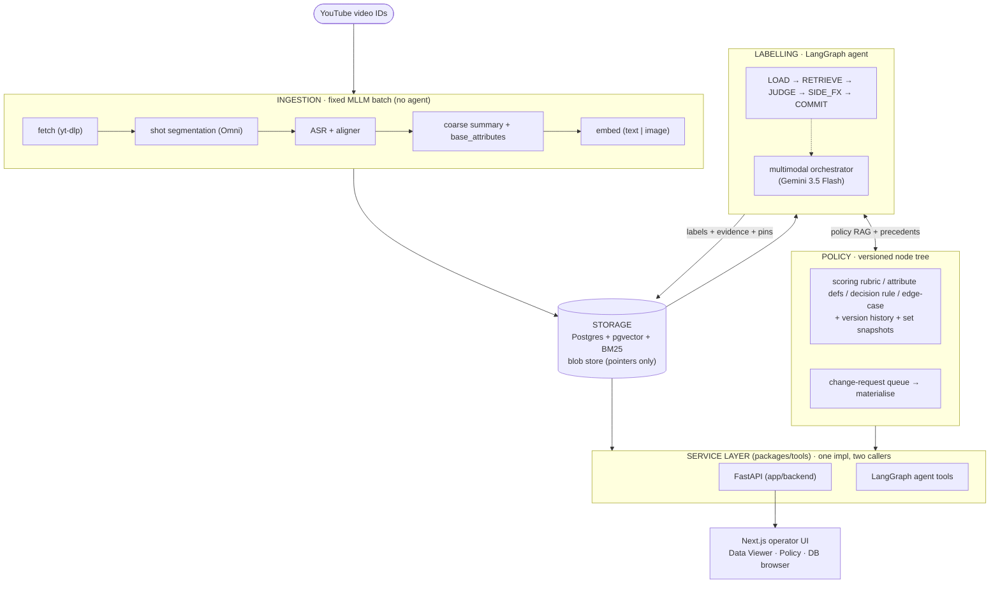
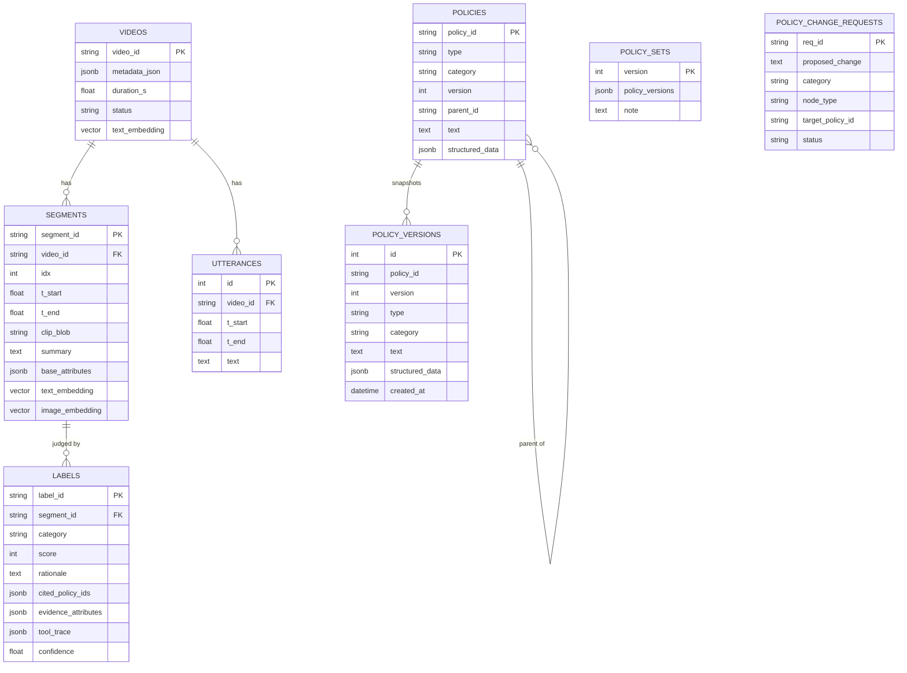
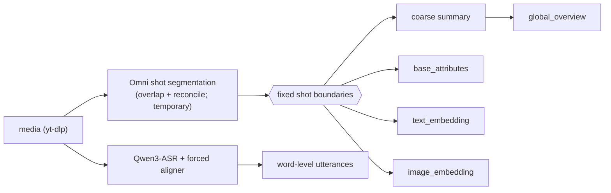
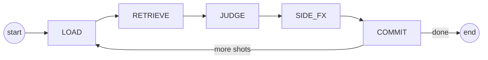
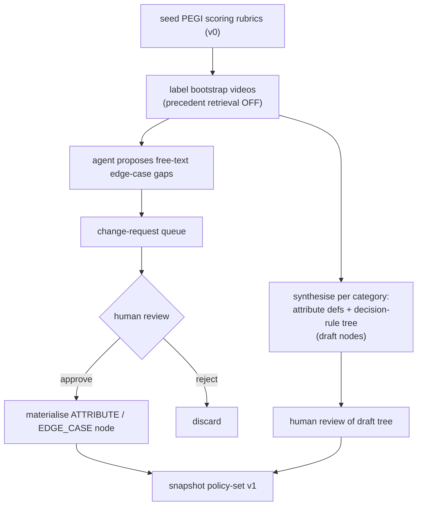

# Architecture

*Language: **English** · [한국어](ARCHITECTURE.ko.md)*

Agentic auto-labelling system for **gameplay video content moderation** (PoC).
Videos are judged at **shot (segment) granularity**; the overriding goal is
**consistent + traceable** labels. PoC scope: PEGI subset
**Gambling / Bad Language / Sex**, age score **0–5**.

Deep dives: **[DATA_FLOW.md](DATA_FLOW.md)** · **[AGENT_WORKFLOW.md](AGENT_WORKFLOW.md)**.

## System at a glance



**Two axes, connected only through storage.** `ingestion/` is a fixed MLLM batch
pipeline (no agent) that fixes shot boundaries and produces
`summary + base_attributes + embeddings`. `labelling/` is the agent that reads
those and judges. They never call each other directly — only via Postgres + the
blob store. **One service layer, two callers:** all real logic lives in
`packages/tools`; both the FastAPI routers and the agent tools call the same
functions.

## Repository map

| Path | Responsibility |
|------|----------------|
| `packages/schemas` | Pydantic domain contracts shared by every layer |
| `packages/models` | Provider abstraction (`providers.py`) + config/profile loader; **config-driven provider dispatch** |
| `packages/tools` | Service layer: `storage`, `blob`, `embeddings`, `retrieval`, `policy_store`, `db_browser` |
| `ingestion` | Fixed pipeline: segmentation, ASR, summary, base attributes, embeddings |
| `labelling` | LangGraph agent: `graph.py` (state machine), `state.py`, `tools.py` |
| `policy` | `bootstrap.py` — seed PEGI rubrics + draft a policy set from unlabelled data |
| `app/backend` | FastAPI HTTP surface over the service layer |
| `app/ui` | Next.js operator console |
| `db` | SQLAlchemy models + Alembic migrations |
| `config` | `config.yaml` (base params) + `profiles/<MODEL_PROFILE>.yaml` (per-role models) |

## Data model



Storage rules: **Postgres** holds relational rows + `pgvector` dense embeddings
(text 2560 / image 2048) + BM25 functional GIN indexes; the **blob store** holds
media/clips/keyframes/thumbnails and the DB keeps only pointers. Attributes are
two-layer — `base` (ingestion, policy-independent) vs `policy` (agent-derived).
Every `Label` pins the `(policy_id, version)` it used; `policy_versions` makes
that pin reproducible to the exact text.

## Ingestion (fixed, no agent)



Boundaries are frozen here (the agent never changes them). The Omni segmenter is
a deliberate placeholder for a future dedicated shot-cut model. `base_attributes`
are model-free facts computed from data already produced (`has_speech`,
`shot_seconds`, `asr_word_count`, `summary_len`) — no longer a gap. ASR receives a
**language hint** from the fetched metadata (ISO code → full English name) so
auto-detect does not mislabel non-English audio.

## Labelling agent (LangGraph)



A shot window slides (`size 5 / stride 3`) with a rolling carry-over summary and
the always-injected global overview. **JUDGE** is per shot × category and takes
one of two routes: a category with **attribute definitions + a decision-rule
tree** has each defined attribute extracted (value + evidence) from ≤5 frames +
summary + ASR, then the tree is applied **deterministically** to a score;
categories with no synthesised policy — and every category during bootstrap — use
the **holistic multimodal fallback** (one scoring call). A label's provenance is
its `evidence_attributes`, its canonical `(policy_id, version)` pins, and the
matched-rule note; `tool_trace` keeps only a compact `decision` entry. Full
stage/tool detail in [AGENT_WORKFLOW.md](AGENT_WORKFLOW.md).

## Policy tree & bootstrap loop

A category's policy is three parts, each a versioned node under the category root:
a **scoring rubric** (SCORING), **attribute definitions** (ATTRIBUTE — general
observable signals: a closed enum or ordinal with per-value label/description/
examples, detection guidelines, and the score bands they inform, in
`structured_data.kind = attribute_def`), and a **decision rule tree**
(DECISION_RULE — `structured_data.kind = decision_tree` with a `default` and
priority-ordered `rules`; first fully-matching rule wins, else the default), plus
incremental EDGE_CASE nodes. Every node is versioned and each edit appends a
`policy_versions` snapshot so a label's `(policy_id, version)` pin reproduces the
exact text.



Bootstrap reuses the normal agent loop with cross-data retrieval disabled (no
confirmed labels exist yet); only scoring rubrics are seeded. After exploring the
bootstrap videos, `synthesize_category_policy` drafts each category's attribute
definitions + a decision-rule tree **from the observed segments** — direct draft
writes, human-reviewed before a policy-set v1 snapshot. Free-text edge-case
proposals are **always** human-gated; approving one materialises a real ATTRIBUTE
/ EDGE_CASE node under the category's scoring rubric.

## Model roles & providers

Per-role models are chosen in `config/profiles/<MODEL_PROFILE>.yaml`; factories
in `packages/models/providers.py` **dispatch on each role's `provider`** and
raise a clear error for any provider not wired in this PoC. `local` is the wired
default.

| Role | Provider | Model (local profile) | Notes |
|------|----------|-----------------------|-------|
| `mllm` | vllm | Qwen3-Omni-30B-A3B-Instruct | shot segmentation + summary; served via vllm-omni (audio-capable) |
| `asr` | vllm | Qwen3-ASR-1.7B + ForcedAligner | word-level transcripts |
| `text_embedding` | vllm | Qwen3-Embedding-4B | dim 2560 (matches DB) |
| `image_embedding` | vllm | Qwen3-VL-Embedding-2B | dim 2048 (matches DB) |
| `agent_llm` | google-genai | Gemini 3.5 Flash | labelling orchestrator (multimodal) |

## API surface (FastAPI)

| Endpoint | Purpose |
|----------|---------|
| `GET /api/videos?search=&page=&page_size=` | paginated gallery (title/duration/thumbnail/n_segments) |
| `GET /api/videos/{id}` · `/segments` · `/thumbnail` | video detail, shots, JPEG thumbnail |
| `GET /api/labels?segment_id=` | labels with evidence attributes + policy pins |
| `GET /api/policies?category=` · `GET /api/policy-sets` | policy tree + set versions |
| `GET/POST /api/policy-change-requests[/{id}/resolve]` | review queue; approve → materialise |
| `GET /api/db/tables[/{name}]` | read-only DB browser (vector cols summarised) |
| `POST /api/ingest` · `POST /api/label` · `GET /api/runs/{id}` | pipeline runs |
| `POST /api/search/{policies,segments,qa}` · `GET /api/metrics,/queue,/consistency` | retrieval + monitoring |

## Web UI (Next.js)

- **Data Viewer** (`/viewer`, `/viewer/[video_id]`) — searchable/paginated gallery
  → YouTube embed + per-category segment timeline + label trace.
- **Policy** (`/policy`) — versioned tree + policy-set list + change-request queue.
- **DB browser** (`/db`) — paginated read-only table explorer.

## Setup & run

```bash
pip install -e ".[dev]"                                 # flat imports (see pyproject)
docker compose up -d postgres                           # or a local Postgres
alembic -c db/alembic.ini upgrade head                  # schema
bash scripts/serve_vllm.sh                              # local model servers (GPU)
bash scripts/run_backend.sh                            # backend :8000 (neutral app-dir)
cd app/ui && npm install && npm run dev                 # UI :3000
pytest                                                  # 45 pure-helper tests
```

`MODEL_PROFILE=local` is the wired profile; set `GENAI_API_KEY` for the Gemini
orchestrator. `regular` is a proprietary template and is not wired.

**Observability (optional).** Labelling is traced with **Langfuse** when
`LANGFUSE_PUBLIC_KEY` + `LANGFUSE_SECRET_KEY` (self-hosted: also `LANGFUSE_HOST`)
are set — one trace per `label_video` run, a span per LangGraph node, and nested
generation spans for the direct-SDK LLM calls (Gemini orchestrator, GPT policy
author). With the env unset, `models.tracing` degrades to a no-op and nothing is
sent (`packages/models/tracing.py`).

## Testing

`tests/` covers pure, DB-free helpers — score clamping, lenient JSON parse, ASR
merge, window cursor/route, retrieval fusion, word-list lookup — with a
`conftest.py` that resolves the flat-package `db` namespace shadow. Consistency
**validation** (cross-sample + reproducibility metrics) is deliberately the last
PoC milestone and is currently stubbed.
