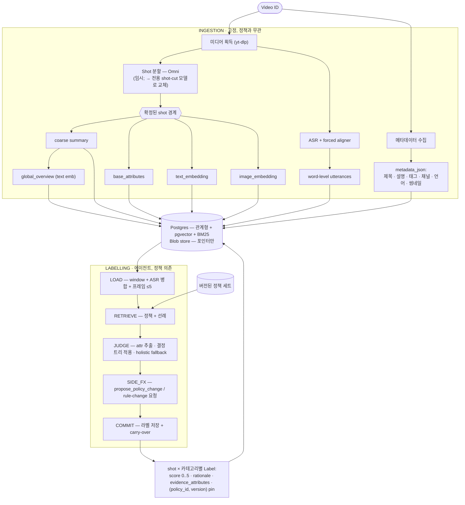

# 데이터 흐름 (Data Flow)

*언어: [English](DATA_FLOW.md) · **한국어***

영상이 원본 미디어에서 감사 가능한(auditable) shot 단위 모더레이션 라벨까지
이동하는 과정. 두 축 — **ingestion**(고정 MLLM 파이프라인)과
**labelling**(에이전트) — 은 서로 직접 호출하지 않고 **storage로만** 연결된다.

## Storage가 유일한 계약(contract)

- **Postgres**가 단일 웨어하우스: 관계형 테이블 + **pgvector** dense 임베딩 +
  **BM25** lexical (정책 텍스트와 segment transcript/summary에 대한
  `to_tsvector('simple', …)` GIN 인덱스). 임베딩 차원은 활성 모델 프로파일을
  따른다 (text = 2560, image = 2048).
- **Blob store**는 대용량 미디어(원본 영상, shot별 av clip, keyframe, thumbnail)를
  보관한다. DB는 **포인터만** 저장한다 (`source_blob`, `clip_blob`,
  `thumbnail_blob`, `frame_ptrs`) — 바이트는 저장하지 않는다.
- `packages/schemas`의 Pydantic 모델이 모든 계층이 매핑하는 공유 계약이다.
  ingestion, labelling, backend, UI 모두 이 계약을 사용한다.

## Ingestion 축 (고정, 에이전트 없음)

입력은 **Video ID**이며, 미디어는 별도로(공개 도구 예: `yt-dlp`) 획득해 blob
store에 저장한다. 영상 메타데이터(title / description / tags / channel /
language / thumbnail)는 별도로 수집해 `videos.metadata_json`에 저장한다.

1. **Shot 분할** — Omni MLLM이 overlap window + overlap별 reconcile로 shot 경계를
   확정한다. *이 방식은 임시이며, 향후 전용 shot-cut 모델(예: OmniShotCut 계열
   분할기)로 교체될 예정이다.* 경계는 **여기서 확정(freeze)** 되며 에이전트는
   경계를 바꾸지 않는다.
2. **shot별 base 계층** — 각 shot마다 coarse `summary`, 정책 무관
   `base_attributes`, `text_embedding`(summary + ASR), `image_embedding`(clip).
   정책이 바뀌어도 재계산이 필요 없다.
3. **영상 전체** — `global_overview`(shot summary 집계, text embedding)와
   **word-level ASR** utterance(Qwen3-ASR + forced aligner, 고정 window)를 영상
   타임라인 기준으로 별도 `utterances` 테이블에 저장. ASR에는 수집된 메타데이터에서
   얻은 **언어 힌트**(오디오 언어 ISO 코드를 정식 영어 이름으로 매핑)를 전달해
   auto-detect가 비영어 오디오를 오분류(예: 한국어를 중국어로)하지 않도록 한다.

구체적인 `base_attributes`는 이미 생성된 데이터에서 파생하는 모델 없는 관측치다
— `has_speech`, `shot_seconds`, `asr_word_count`, `summary_len` — 의도적으로
사실 위주이며 카테고리 판정이 아니다(판정은 에이전트의 몫). Attribute는
**2계층**이다: `base`(여기, ingestion) vs `policy`(이후 에이전트가 파생).
`Attribute.layer`가 이를 구분한다.

## Labelling 축 (에이전트, 정책 의존)

각 카테고리의 정책은 세 부분이다 — **scoring 루브릭**, **attribute
definition**(일반적 관측 신호, 각각 닫힌 enum 또는 ordinal), **결정 규칙 트리** —
모두 버전된 노드다. 에이전트는 shot window와 **버전된 정책 세트**,
**선례(precedent)**(유사 shot + 그 확정 라벨)를 읽고, shot × 카테고리마다 `Label`을
생성한다. attribute definition + 규칙 트리가 있는 카테고리는 shot에서 정의된 각
attribute를 **추출**한 뒤 트리를 **결정적으로 적용**해 점수를 낸다. 합성된 정책이
없는 카테고리는 holistic 채점으로 폴백한다.

라벨의 감사 기록은 **evidence_attributes**(추출된 신호 + evidence + attribute
노드의 version), **cited_policy_ids**(attribute-def 노드와 규칙 노드의 정규
`(policy_id, version)` pin), 그리고 rationale에 담긴 매칭 규칙 note다.
`policy_versions` 히스토리가 pin된 정확한 텍스트를 재현한다. (`tool_trace`에는 단일
compact `{"decision": …}` 항목만 남는다 — 이전의 장황한 stage/tool 덤프는 제거됨.)

상태 머신은 **[AGENT_WORKFLOW.ko.md](AGENT_WORKFLOW.ko.md)** 참고.

## 각 store row가 담는 것

| 테이블 | 주요 필드 | 생성 주체 |
|-------|-----------|-----------|
| `videos` | metadata_json, duration_s, source_blob, global_overview, text_embedding, status | ingestion + 메타데이터 수집 |
| `segments` | idx, t_start/t_end, clip_blob, transcript, summary, base_attributes, text/image_embedding | ingestion |
| `utterances` | idx, t_start/t_end, text | ingestion (ASR) |
| `policies` | type (scoring/attribute/decision_rule/edge_case), category, version, parent_id, text, embedding, structured_data | policy store / bootstrap |
| `policy_versions` | policy_id, version, type, category, text, structured_data, created_at | policy store (append-only 히스토리) |
| `policy_sets` | version, policy_versions 맵 | policy 스냅샷 |
| `labels` | category, score, rationale, cited_policy_ids, evidence_attributes, used_segment_ids, tool_trace (compact decision) | labelling 에이전트 |
| `policy_change_requests` | proposed_change, rationale, category, node_type, target_policy_id, status | 에이전트 SIDE_FX (human 승인 대기) |
