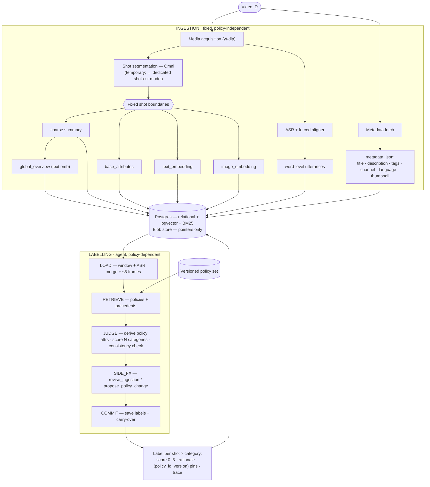

# Data Flow

*Language: **English** · [한국어](DATA_FLOW.ko.md)*

How a video moves from raw media to auditable shot-level moderation labels.
Two axes — **ingestion** (fixed MLLM pipeline) and **labelling** (the agent) —
never call each other directly; they are connected only through storage.

## Storage is the only contract

- **Postgres** is the single warehouse: relational tables + **pgvector** dense
  embeddings + **BM25** lexical (`to_tsvector('simple', …)` GIN indexes on
  policy text and segment transcript/summary). Embedding dims follow the active
  model profile (text = 2560, image = 2048).
- **Blob store** holds large media (source video, per-shot av clips, keyframes,
  thumbnails). The DB stores **pointers only** (`source_blob`, `clip_blob`,
  `thumbnail_blob`, `frame_ptrs`) — never the bytes.
- The Pydantic models in `packages/schemas` are the shared contract every layer
  maps to/from. Ingestion, labelling, the backend, and the UI all speak these.

## Ingestion axis (fixed, no agent)

Input is a **Video ID**; media is acquired out of band (public tooling such as
`yt-dlp`) and stored in the blob store. Video metadata
(title / description / tags / channel / language / thumbnail) is fetched
separately and stored in `videos.metadata_json`.

1. **Shot segmentation** — the Omni MLLM fixes shot boundaries over overlapping
   windows with per-overlap reconciliation. *This is a temporary mechanism and
   is expected to be replaced by a dedicated shot-cut model (e.g. an
   OmniShotCut-style segmenter).* Boundaries are **frozen here**; the agent
   never changes them.
2. **Per-shot base layer** — for each shot: a coarse `summary`, policy-independent
   `base_attributes`, a `text_embedding` (summary + ASR) and an `image_embedding`
   (clip). These never need recomputation when policy changes.
3. **Whole-video** — a `global_overview` (aggregated shot summaries, text
   embedding) and **word-level ASR** utterances (Qwen3-ASR + forced aligner over
   fixed windows) stored on the video timeline in a separate `utterances` table.

Attributes are **two-layer**: `base` (here, ingestion) vs `policy` (derived later
by the agent). `Attribute.layer` distinguishes them.

## Labelling axis (agent, policy-dependent)

The agent reads a shot window plus the **versioned policy set** and **precedents**
(similar shots + their confirmed labels), and emits a `Label` per shot per
category. Every label pins the `(policy_id, version)` it used and carries the
full `tool_trace`; that pin + trace is what makes a label auditable. Policy-layer
attributes derived during judging are attached as evidence.

See **[AGENT_WORKFLOW.md](AGENT_WORKFLOW.md)** for the state machine.

## What each store row carries

| Table | Key fields | Produced by |
|-------|-----------|-------------|
| `videos` | metadata_json, duration_s, source_blob, global_overview, text_embedding, status | ingestion + metadata fetch |
| `segments` | idx, t_start/t_end, clip_blob, transcript, summary, base_attributes, text/image_embedding | ingestion |
| `utterances` | idx, t_start/t_end, text | ingestion (ASR) |
| `policies` | type, category, version, parent_id, text, embedding, structured_ref | policy store / bootstrap |
| `policy_sets` | version, policy_versions map | policy snapshot |
| `labels` | category, score, rationale, cited_policy_ids, evidence_attributes, used_segment_ids, tool_trace | labelling agent |
| `policy_change_requests` | proposed_change, rationale, status | agent SIDE_FX (queued for human) |
